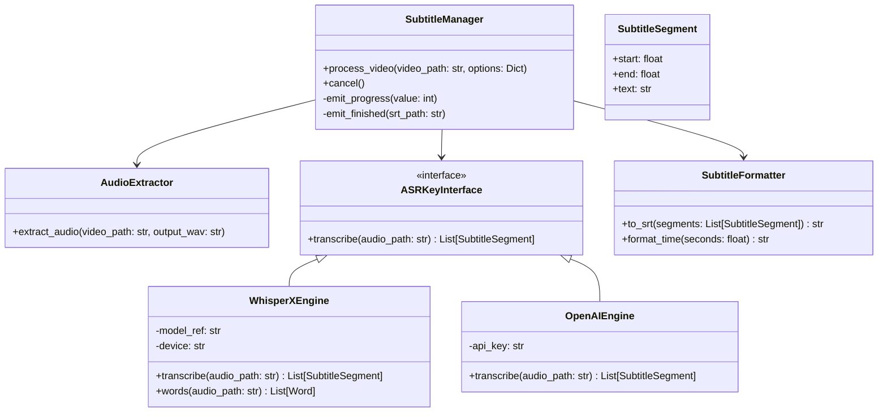

# 视频编辑器人声转字幕功能设计文档

## 1. 概述
本功能旨在为视频编辑器增加“人声转字幕”能力，支持从视频轨道提取音频，通过语音识别模型转换为文本，并生成 SRT 字幕文件，最终支持嵌入到视频容器中。

## 2. 技术选型（WhisperX）

本项目本地字幕统一采用 WhisperX（Whisper 转写 + 强制对齐），核心目标是得到稳定、细粒度的时间轴（可选逐词时间戳），以便做断句、卡点、逐词高亮等能力。

| 维度 | 说明 |
| :--- | :--- |
| **核心优势** | 强制对齐获得更精细的时间轴，适合高质量字幕（逐词时间戳）。 |
| **架构原理** | Whisper 转写 + wav2vec2/对齐模型生成 word-level timestamps。 |
| **部署体积** | 依赖较多（torch/transformers 等），但模型可集中缓存到 `models/`。 |
| **结论** | 本地字幕仅提供 WhisperX；同时保留 OpenAI API 作为云端备选。 |

**决策**：本项目本地字幕采用 **WhisperX**；普通用户默认 CPU 推理；需要 GPU 加速时提供 GPU 版安装包（按需下载）。

## 3. 系统架构设计

### 3.1 类图 (Class Diagram)



## 4. 详细实现步骤

### 阶段一：音频流提取 (Audio Extraction)
智能判断音频来源，优先使用原始录音文件以提高速度和识别准确率（纯人声无干扰）。

*   **逻辑流程**:
    1.  **检查输入**: `SubtitleManager` 接收 `video_path`, `mic_path` (可选), `sys_path` (可选)。
    2.  **分支处理**:
        *   **情况 A (录制刚完成)**: 如果提供了 `mic_path` 且文件存在，**直接使用该文件**作为 ASR 输入。
            *   *优势*: 无需 FFmpeg 提取，速度极快；且仅包含人声，无系统音干扰，识别率最高。
        *   **情况 B (导入视频/无独立音轨)**: 如果没有 `mic_path`，则调用 FFmpeg 从 `video_path` 中提取。
            *   *命令*: `ffmpeg -y -i "{input_path}" -vn -acodec pcm_s16le -ar 16000 -ac 1 "{output_path}"`

*   **输出统一**: 无论来源如何，最终都向 ASR 引擎提供一个符合要求的音频路径（16kHz WAV）。

### 阶段二：语音识别 (ASR)

#### 策略 A: 本地 WhisperX（默认）
1.  **依赖**: `whisperx`（内部包含/依赖 faster-whisper、torch、transformers 等）。
2.  **流程**:
    *   使用 Whisper 模型进行转写（CPU/GPU 可选）。
    *   使用对齐模型进行强制对齐，生成逐词时间戳（word-level timestamps）。
    *   生成 SRT，同时输出 `<srt>.words.json` 作为逐词时间戳 sidecar 文件，方便后续逐词高亮/编辑。
3.  **模型与缓存目录**:
    *   模型清单：`models/manifest.json`
    *   模型缓存：`models/whisperx/`（含 whisper/align/hf_home）
4.  **上限**: 第一版限制最长 60 分钟/条，超过直接提示用户分割。

#### 策略 B: 云端 OpenAI API
1.  **依赖**: `openai` (Python包)。
2.  **流程**:
    *   读取用户配置的 API Key。
    *   调用 `client.audio.transcriptions.create(model="whisper-1", response_format="verbose_json", ...)`。
    *   直接获取包含 segments 的 JSON 响应。

### 阶段三：字幕文件生成 (Subtitle Generation)
将 ASR 返回的 `SubtitleSegment` 列表转换为 SRT 格式。

*   **SRT 格式规范**:
    ```text
    1
    00:00:01,000 --> 00:00:04,000
    这里是第一句字幕。

    2
    00:00:04,500 --> 00:00:06,000
    这里是第二句。
    ```
*   **时间戳格式化**: `HH:MM:SS,mmm` (注意毫秒用逗号分隔)。

### 阶段四：软字幕嵌入与预览
在 `VideoEditor` 的导出流程中集成字幕流。

*   **软字幕嵌入 (Soft Subs)**:
    在 `ExportThread` 的最终合并阶段，添加字幕输入。
    **FFmpeg 命令**:
    ```bash
    ffmpeg -i video.mp4 -i subs.srt -c copy -c:s mov_text -metadata:s:s:0 language=chi output.mp4
    ```
    *(注: MP4 容器使用 `mov_text` 编码，MKV 可使用 `srt` 编码)*

*   **编辑器预览 (可选)**:
    在 `TimelineWidget` 上增加一个字幕轨道，解析生成的 SRT 文件，在 `VideoRenderWidget` 绘制视频帧后，使用 `QPainter` 在画面底部绘制当前时间点的字幕文本。

## 5. 依赖与环境
需要在 `requirements.txt` 中添加：

```text
# 本地推理（WhisperX）
whisperx
faster-whisper
ctranslate2
transformers
torch
torchaudio

# 云端推理
openai>=1.0.0
```

## 6. 目录结构规划

```
src/
  subtitle_system/
    __init__.py
    manager.py          # SubtitleManager
    extractor.py        # AudioExtractor
    formatter.py        # SubtitleFormatter
    model_registry.py   # models/ 下本地模型扫描与清单解析
    engines/
        base.py         # ASRKeyInterface
        whisperx_engine.py
        openai_engine.py
models/
  manifest.json       # 本地模型清单（可扩展，支持自由切换）
  whisperx/
    whisper/          # 本地 whisper 模型目录或缓存
    align/            # 对齐模型缓存
    hf_home/          # HuggingFace 缓存（hub/transformers/torch）
```
